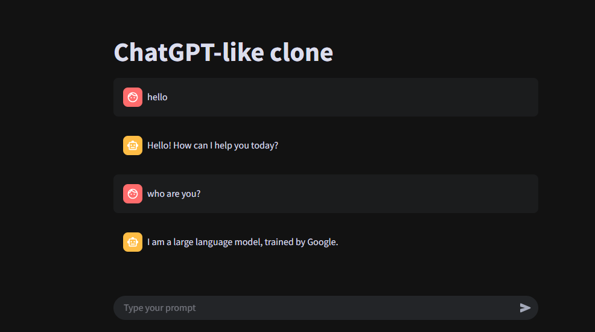

# Chatbot with Gemini API (Streamlit)

A simple ChatGPT-like chatbot built using Streamlit and Gemini 2.0 Flash API (OpenAI-compatible).



## 🔧 Features
- Real-time streaming responses
- Chat history using Streamlit's session state
- Clean UI with chat bubbles

## 🚀 Getting Started

1. Clone the repo:
```bash
git clone https://github.com/your-username/chatbot.git
